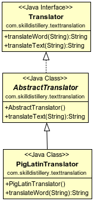

## PigLatin Translator Project

### Description

This application takes a word or phrase and uses regex to translate to "PigLatin."

### Technologies Used
Java, git, Eclipse, 	vi

### Lessons Learned
Milestone was creatnig JUnit test cases before implementing methods.
The regex can be used in a variety of forms
Refactored down to one method in main.
Further Development needed on returning the punctuation.

### UML Diagram
